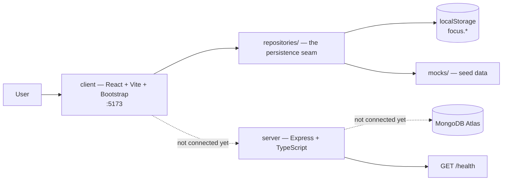
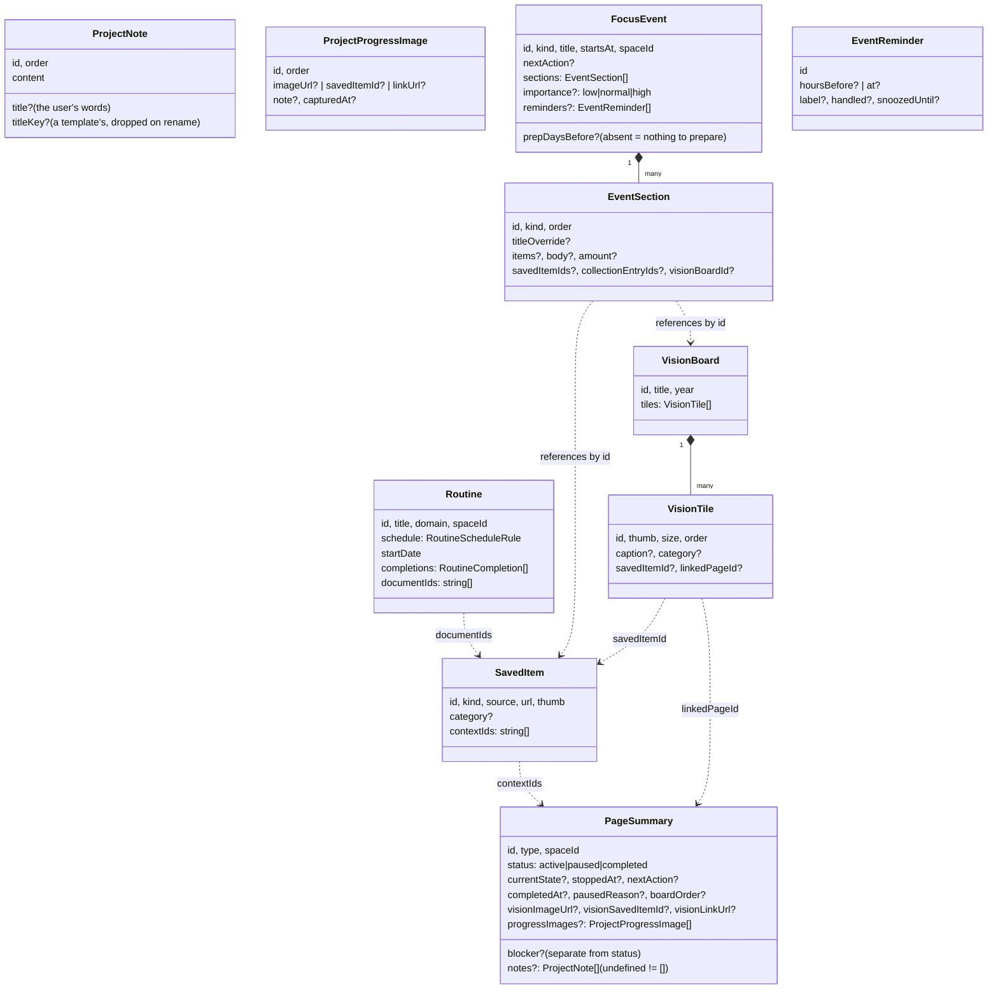
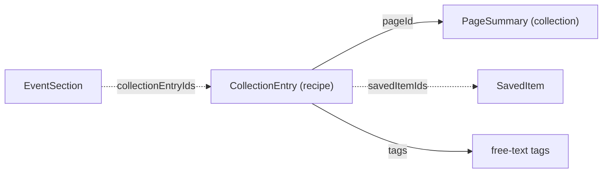
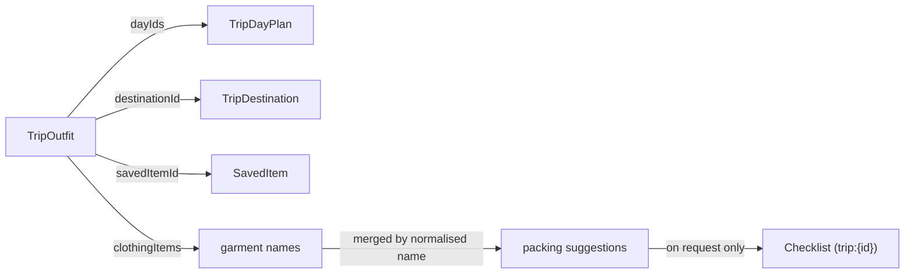
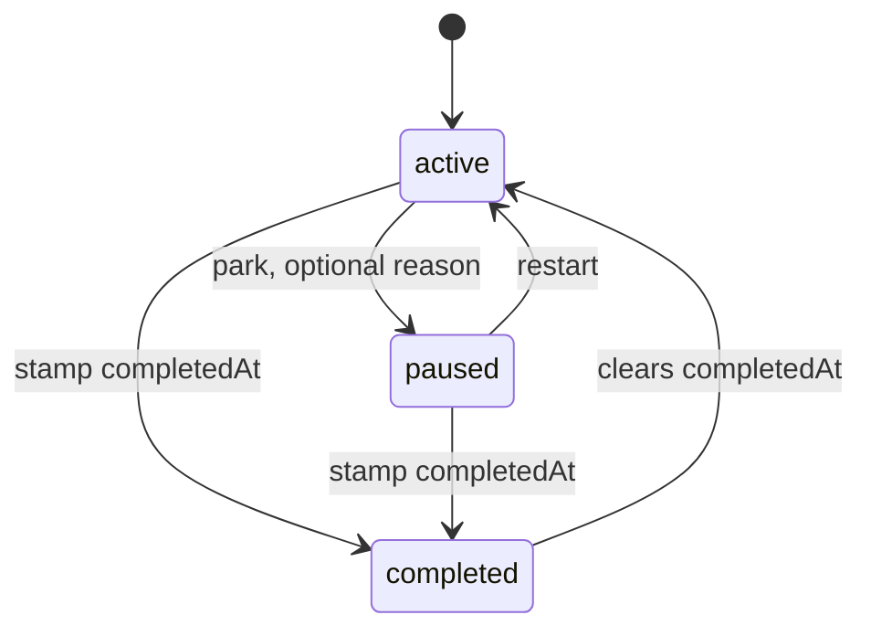
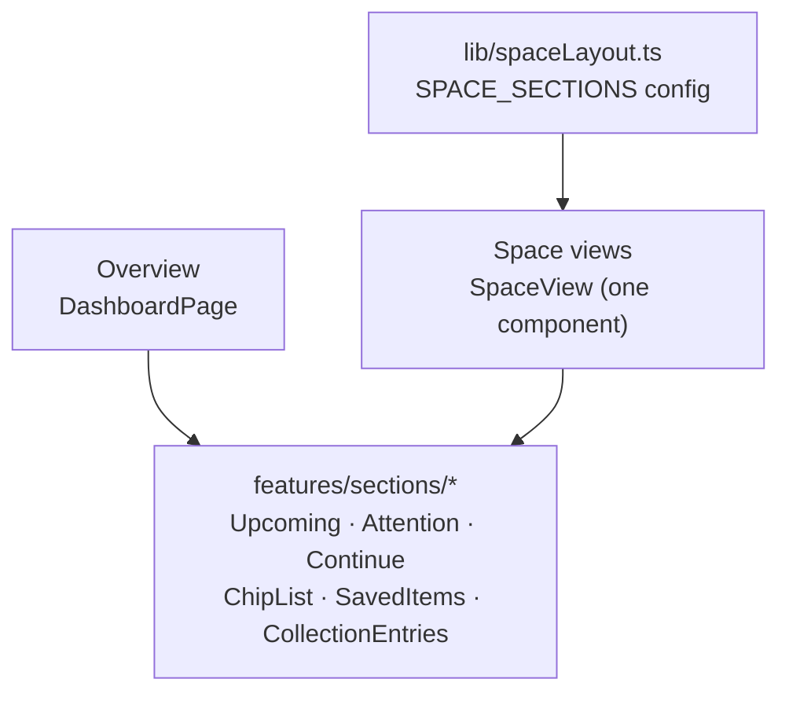

# Architecture

Short description of the system's shape and its boundaries.
For what is built versus planned, see [PROJECT_STATE.md](PROJECT_STATE.md).

## System shape

Two independent applications in one repository, each with its own
`package.json` and `node_modules`. No monorepo tooling, no workspaces — the
repo started this way and nothing yet justifies the extra machinery.



Solid arrows are wired today. Dashed arrows are planned.

## Client / server boundaries

**The client owns** routing, rendering, layout, client-side search and
filtering, and derived view data (`lib/pageSelectors.ts`). It holds no
authority: any rule it enforces is a convenience, re-checked on the server.

**The server owns** the HTTP contract, input validation, authentication,
authorisation, and every database access. It is the only component that can
decide what a user is allowed to see or change.

**Neither owns** shared domain types today — they live in `client/src/types/`
and move to a shared package when the API is built. See CLAUDE.md → Type
placement.

## Presentation layers

The client is deliberately layered so that swapping the data source later
touches one file, not the UI:

```
types/         domain shapes        (no React, no i18next)
mocks/         seed data            (replaced by the API)
lib/           pure logic           selectors, Intl formatting, schedules,
                                    board rules, event templates
lib/storage/   the only localStorage access in the app
repositories/  Repository<T> per slice — load / save
state/         one provider per slice — the only place data is held
features/      sections/ + screens  composition only
components/    ui/ + layout/        presentation primitives
i18n/          language + direction
```

`lib/` never imports from `features/`, and nothing outside `state/` holds
application data. `features/sections/` holds the shared section components; the
screens choose which sections to render and in what order.

The dependency direction is strict and one-way:

```
components → state → repositories → lib/storage → localStorage
                          ↑
                       mocks (seed only)
```

A component that reads `window.localStorage` is a bug. A `lib/` module that
imports a provider is a bug.

## Data models



Dashed arrows are **references by id**, and that is the whole point: a recipe
attached to a holiday, a plan attached to a routine and a picture on a vision
board are all the same stored entity seen from three places. Nothing is copied.

## Shared checklist

One model, one component, one provider, used by trips, projects and (next)
events.

```
types/checklist.ts        Checklist · ChecklistGroup · ChecklistItem · ChecklistTemplate
lib/checklist.ts          pure edits: toggle, add, update, remove, move,
                          collapse, fromTemplate, toTemplate, duplicate, progressOf
state/ChecklistsProvider  Record<ownerId, Checklist> + personal templates
components/ui/Checklist   the UI; every control is a real control
features/checklist/…      creating one: template · copy · empty · save template
```

Two decisions carry the design:

- **Keyed by owner** (`project:sorcol`, `trip:japan-2027`), so no entity has to
  carry a checklist id, and a list can be attached to anything that has an id.
- **Built-in templates store translation keys**, not words. A group has a
  `titleKey` and an item a `textKey` until the user edits it, at which point it
  becomes `title` / `text` and the key is dropped. That is what lets five trip
  templates ship in Hebrew and English without either language ending up in
  somebody's stored data.

The provider exposes a single `update(ownerId, change)` that applies a pure
function from `lib/checklist.ts`. The rules live in `lib/`; the provider only
persists.

## Recipes, tags and references

`CollectionEntry` is one model for recipes **and** places. Recipe-shaped fields
(ingredients, steps, times, rating) are optional; a place simply has none.



Dashed arrows are references by id. A holiday menu points at a recipe; it never
holds a copy of one, so improving the recipe improves the menu.

**Status is two fields.** `status: want_to_try | tried` and
`recommended: boolean`. The board's three columns are a view over the pair:

| Dropped into | `status` | `recommended` |
|---|---|---|
| Want to try | `want_to_try` | `false` |
| Tried | `tried` | `false` |
| Recommended | `tried` | `true` |

Taking a recipe out of "recommended" therefore clears the flag and leaves it
tried — it cannot silently un-try something. That is the entire reason
"recommended" is not a third status.

## Trips

```mermaid
classDiagram
  class Trip {
    id, title, countries
    startDate, endDate, status
    nextAction?, notes?
  }
  class TripDestination {
    id, name, country
    arriveOn?, leaveOn?
    imageUrl?, thumb?
    goodToKnow[], clothing?
    savedItemIds[]
  }
  class TripDayPlan {
    id, date, destinationId
    morning?, afternoon?, evening?
    alternatives?, bookings?, clothing?, notes?
  }
  class TripFood {
    id, destinationId, name, kind
    address?, note?, url?, day?
    status: option|planned|visited
  }
  class TripFlight
  class TripStay
  Trip "1" *-- "many" TripDestination
  Trip "1" *-- "many" TripDayPlan
  Trip "1" *-- "many" TripFood
  Trip "1" *-- "many" TripFlight
  Trip "1" *-- "many" TripStay
  TripDestination ..> SavedItem : savedItemIds
  Trip ..> Checklist : "trip:{id}"
```

Composition, not separate slices: destinations, days and food are never read
without the trip, so one write per edit cannot leave them disagreeing. Morning,
afternoon and evening are three *fields on a day*, not three systems — the same
reason clothing, bookings and notes sit in the same card.

There is no map and no calendar integration. An address and a note is what
people actually re-read; a map would be a different product.

## Vision board pictures

A tile carries `thumb` (local artwork), `imageUrl` (remote), or both. Only the
address of a remote picture is stored — never the bytes, never a data URI — so
a board with thirty pictures is still a few kilobytes and a picture the user
removes is genuinely gone.

`<BoardImage>` resolves the three cases in order: a valid remote address, then
local artwork, then a visible placeholder. A remote image that fails to load
falls back rather than rendering a broken-image icon, because a tile that
vanishes silently looks like data loss.

## Project page composition

```
vision picture   optional; where the project is going
brief (no tab)   where it stands · where you stopped · blocker · next action
notes            ProjectNote[] — as many or as few as the project has
progress         ProjectProgressImage[] — where it is now
tabs
  tasks          the shared Checklist, keyed page:{id}
  materials      saved items that are not pictures — documents, links, notes
  inspiration    saved items that are: inspiration, image, product
  history        updates, status changes, completion dates
```

There is deliberately no Overview tab: it would repeat the brief above it. There
is no Future tab either — it held one optional field, which is an ordinary note
now.

### Notes vs fields: where the line is

The page used to render nine fixed rubrics. Six are now free-form notes; four
remain structured fields. **The dividing line is whether anything other than
this page reads the value.**

| Field | Read by | Verdict |
|---|---|---|
| `currentState` | overview, board | field |
| `stoppedAt` | overview's "pick up where you left off" | field |
| `blocker` | overview's attention list, `isBlocked()` | field |
| `nextAction` | overview, every board card | field |
| `description`, `outcome`, `doneSoFar`, `afterThat`, `lastDecision` | this page only | note |

Converting the first four to prose would have emptied half the overview and left
`isBlocked()` with nothing to test. The other five fed nothing, which is exactly
what made them safe to free.

### The legacy conversion is an adapter

```
notesForPage(page)
  page.notes !== undefined  → return it (including [])
  page.notes === undefined  → derive from legacy fields, skipping empty ones
```

Nothing is rewritten on load and no legacy field is dropped from the type or the
data. The first edit persists the derived list, so conversion happens once, per
page, on demand — a page nobody opens is never touched.

`undefined` and `[]` mean different things and are never collapsed: absent is
"never edited, read the old fields", empty is "the user deleted them all". A
migration that defaulted `notes` to `[]` would silently erase every project
written before the change, which is why `pageOverridesRepository`'s migration
maps `override.notes?.map(...)` and never supplies a fallback.

A template-seeded note stores a `titleKey` and no `title`; renaming drops the
key and stores the user's words. Same rule as event sections and checklist
groups: a template writes no language into stored data.

### Project pictures

`visionImageUrl` / `visionSavedItemId` / `visionLinkUrl` are written together by
`setVisionImage`, so a new choice replaces the old one rather than layering a URL
over a stale saved-item reference. `resolveImage` turns a source into
`{ imageUrl, thumb }` and hands both to `<BoardImage>`, which tries the address
and falls back to seeded artwork **only when there is no address at all**. A
source that is a page rather than a picture stays a link.

## Learning pages

```
identity      title · subject · status · level        (chips, one row)
brief         picture · goal · where you stopped · next action · method
              + when it was last actually studied
LEVEL RAIL    all levels | beginner | intermediate | advanced   ← ?level=
notes         ProjectNote[], each optionally filed under a level
practice list the shared Checklist, keyed page:{id} — no template picker
material      links | documents | pictures | videos             ← ?material=
              one panel at a time, every item optionally filed under a level
```

Everything below the rail is filtered by it. Everything above it is not, because
"what am I learning and where did I stop" does not depend on which level you are
inspecting.

### The level, and what "no level" means

`LearningLevel` is `beginner | intermediate | advanced`. It appears in three
places, and means the same thing in all three:

| Where | Stored as | Meaning |
|---|---|---|
| The page | `learning.level` | where the user is *now* |
| A note | `ProjectNote.level` | which level this writing belongs to |
| A resource | `LearningResource.level` | which level this material served |

**Absent means general, not unfiled.** `matchesLevel(level, filter)` returns
true when `level` is `undefined`, whatever the filter is. This is the decision
that makes the rail usable: hiding unlevelled material when somebody narrows to
"beginner" would hide the dictionary link and the "where I stopped" note at the
exact moment they went looking for them. The UI writes "general" beside such an
item, so the user can see which it is rather than guessing.

The filter is a URL query (`?level=beginner`), read through
`levelFilterFrom`, which refuses anything that is not one of the three. Keeping
it in the URL is what makes a refresh, the back button and (later) a shared link
all land on the same view.

### Learning material is `SavedItem`

There is one storage model for all four panels. An item is attached to a page
the ordinary way — `SavedItem.contextIds` — exactly as a recipe's attachments
and a trip's inspiration are. Which panel it appears in is derived from its
`kind` by `resourceTabOf`:

| Panel | Kinds |
|---|---|
| videos | `video` |
| documents | `document` |
| pictures | `image`, `inspiration` |
| links | everything else |

What the panels needed that `SavedItem` does not carry is the level. That is
**not** put on the item: the same YouTube video can be beginner material on one
page and the only advanced thing on another. It lives on the page, as
`LearningFacts.resources: LearningResource[]` — `{ savedItemId, level?, note?,
order? }` — which is the edge between the two, stored on the side that cares.

`learningResources(page, savedItems)` resolves the two together: the attachment
is the fact, the record is decoration. A record for an item that no longer
references the page is ignored rather than resurrected.

### Removing is a tombstone, never a delete

`LearningFacts.detachedResourceIds` lists items that reach the page through
`contextIds` and that the user has taken off *this page*. Nothing is deleted:
the item may be attached to a trip, a recipe and two other pages, and "take this
off my English page" and "delete this video" are different requests. Attaching
something that was previously removed clears its tombstone.

This is also why removal works on seeded material at all — `MOCK_SAVED_ITEMS`
cannot be edited, and a tombstone on the page needs no edit to it.

### No upload, and the shape that leaves room for one

Nothing is uploaded and no file is read. A document is a link to a document, and
the documents panel says so once, where the claim is made. A picture is an
address with a live preview — loading it is the only honest test that it points
at an image — and a broken one renders the neutral `BoardImage` placeholder
("the picture did not load"), never local artwork standing in for somebody's
photograph. A video is a link plus the platform label the user chose; no
metadata is fetched from YouTube, Instagram or TikTok, and no thumbnail is
invented.

The seam for real storage later is `SavedItem.url`. When a file service exists,
an uploaded document becomes a `SavedItem` of kind `document` whose `url` points
at it, and every screen above stays as it is. See `docs/FUTURE_ROADMAP.md`.

### Subjects

A learning subject reuses `ProjectCategory` — a label with an order, no rules,
no container — in **its own slice**, `focus.learningTopics`, seeded with
languages · career · leisure. The value is stored in `PageSummary.categoryId`,
the same field a project category uses, which is safe because
`lib/projectBoard.ts` scopes the board to `type === "project"` and the learning
screen scopes itself to `type === "learning"`.

`topicOf` derives nothing. Unlike `categoryOf` for projects, which falls back to
a subject implied by the space, a learning page with no subject is a complete
learning page; guessing one would file "React Native" under whichever space it
happened to be in and then keep insisting on it.

The four list edits — add, rename, remove, reorder — are pure functions in
`lib/projectCategories.ts` (`addTo`, `renameIn`, `moveIn`, plus `canRemove`) and
are called by both slices. Removing a subject is refused while a page is still
filed under it.

### The adapter for pages written before any of this

Nothing about a stored learning page changed shape. `level`, `goal`, `method`
and `lastStudiedAt` are where they were; `resources`, `detachedResourceIds`,
`ProjectNote.level` and `categoryId` are new optional fields that are simply
absent on older data, and absent is a valid, complete answer for every one of
them. `notesForPage` still reads the legacy narrative fields for a page that has
never been edited, and `notes === undefined` still means "never edited" while
`notes === []` still means "the user deleted every note".

A checklist created from another domain's template — the supermarket list a
learning page could once produce — is recognised by `isForeignChecklist` and
**not** removed by any migration. The page names it and offers to remove it.
Deleting somebody's data to tidy up after the app is not a migration.

### Prepared for sharing, with no sharing in the interface

The screen is already addressed the way a shared view would need to be:
`/pages/:id?level=beginner&material=videos` names a page, a level and a kind of
material. That is deliberate groundwork and nothing more — there is no share
button, no permission model and no public projection, and there will not be one
before a server, a database and users exist. See `docs/FUTURE_ROADMAP.md`.

## Project detail

```
PageDetailPage (/pages/:id)
  ?tab=overview|tasks|materials   · ?kind= · ?q= · ?page=
    header      PageSummary fields + categories
    focus band  page.nextAction, page.blocker, checklist progress
    overview    currentState + stoppedAt, notesForPage(page), images
    tasks       <ChecklistSection ownerId={`page:${id}`} />
    materials   savedItemsFor(page.id) → lib/projectMaterials.ts
```

`checklist` and `learning` pages branch out at the top of the component to their
own views; the rest of the file is the project screen.

### The relationships, all explicit

| From | To | How |
|---|---|---|
| Project | its notes | **Embedded** — `PageSummary.notes: ProjectNote[]` |
| Project | its tasks | `Checklist` keyed `page:<id>` via `checklistOwnerFor` |
| Project | its materials | `SavedItem.contextIds` contains the project id |
| Project | its category | `PageSummary.categoryId`, a stored id |

Nothing is inferred from a title, an id prefix or a route. `sorcol` and
`sorcol-garden` are different projects and a saved item titled "Sorcol quote"
belongs to whichever project its `contextIds` names — there are tests for both.

### The adapter, and why it is safe on every read

`notesForPage(page)` is the compatibility layer between the five old narrative
rubrics and the note model:

- `page.notes` present → those notes, sorted. Including `[]`, which means the
  user deleted every note and must stay empty.
- `page.notes` absent → the legacy fields that **hold something** become notes,
  with stable derived ids (`legacy-description`).

It is **pure and idempotent**, which is what lets it run on every render without
a migration ever writing to storage: the same page produces the same notes with
the same ids however many times it is read, so a refresh cannot duplicate
anything. Saving once takes the page off the adapter permanently. Nothing is
copied and no legacy field is destroyed.

`currentState`, `stoppedAt`, `blocker` and `nextAction` are deliberately **not**
in the adapter. They stay structured fields because the overview screen and the
board read them, and turning them into prose would empty half the overview.

### Materials

`lib/projectMaterials.ts` maps all nine `SavedItemKind`s onto four shelves, so
no item can become invisible, then filters, sorts and pages. Paging clamps
rather than trusts: `?page=9` on a two-page shelf shows the last page instead of
an empty screen. Changing shelf or search resets the page, because page 4 of
"links" means nothing once you are looking at pictures.

### Repository responsibilities

Unchanged. The screen reads `usePages()` and `useChecklists()`; the providers
read `pageOverridesRepository`, `ownPagesRepository`, `savedItemsRepository` and
`checklistsRepository`. Only the *diff* against seeded pages is stored, so demo
data can change between versions without freezing on a user's machine.

## Training

Three things that used to be one, kept apart on purpose.

```
TrainingPage (/training)
  ?area=plans|tracking|materials
    plans     → useTraining()  → trainingPlansRepository   (focus.trainingPlans)
    tracking  → useRoutines()  + useManage()               (existing slices)
    materials → savedItemsFor("training")

TrainingPlanPage (/training/plans/:id)
  ?topic=plan|notes|materials
    plan      → PlanGroups, editing through lib/training.ts
    notes     → plan.notes: ProjectNote[]  → <ProjectNotes>
    materials → savedItemsFor(plan.id)     → <ResourcePanels>
```

### Plan, group, exercise

`TrainingPlan` **owns** its `TrainingGroup[]`, and each group owns its
`TrainingExercise[]`. Embedded rather than three slices, for the reason `Trip`
owns its destinations and days: a group is never read without its plan, so
keeping them together means one write per edit instead of three that could
disagree. Twenty groups of a hundred exercises is a few kilobytes — and it is a
*plan* document, not one growing user document.

Every structural edit is a pure function in `lib/training.ts` returning a whole
plan; the provider exposes a single `putPlan`. The rules stay testable and the
provider only decides where the result is stored.

### Training and scheduling

There is **no link between a plan and a session yet**, and that is deliberate
rather than missing. The two models are already correct — a `Routine` carries
the completion history, a `ScheduledItem` carries a single dated obligation —
and neither contains a copy of any plan. When the link is wanted it is one
optional `EntityReference` on the scheduled side pointing at a plan; nothing
about the plan changes and no exercise is ever duplicated into an event.
Recorded as future work rather than half-built.

### Notes and materials

Notes are embedded (`plan.notes: ProjectNote[]`) and rendered by the same
`<ProjectNotes>` the project, learning and leisure screens use. Material is
referenced: a `SavedItem` lists the plan's id — or the literal `"training"`
context for the area as a whole — in `contextIds`.

`<ResourcePanels>` is shared by training and leisure. It was extracted when the
second real caller appeared, not before, and it is the only component that knows
how a link, a document, a picture and a video are added.

## The overview projection

The overview is the only screen that reads across every slice, and it is a
**projection**: nothing it shows is stored, and there is no dashboard entity.

```
DashboardPage
  useRelevance()                       one hook, so the overview, the reminders
    → collectRelevance(input, now)     screen and the header badge cannot
                                       disagree about what "needs you" means
  lib/dashboard.ts  (pure, no React)
    selectNeedsYouNow(items)        → 5   buckets today + waiting
    selectNextDays(items, {exclude})→ 6   dated, ≤14 days, minus the above
    selectFocusProjects(pages)      → 3   active projects, blocked first
    selectFocusLearning(pages)      → 3   active learning, last studied first
```

### Source entities

Eight, each contributing rows through `collectRelevance` and each tagged with
its `RelevanceSource`: `ScheduledItem`, `FocusEvent` (including birthdays
derived from `FamilyProfile`), `Commitment`, `MoneyEntry`, `Medication`,
checklist and learning `PageSummary`, and `Trip`. Projects and learning reach
the third area directly from `PageSummary` — they are not time-relevant and do
not belong in the relevance stream.

### De-duplication

On the source's identity — `referenceKey(item.reference)` — falling back to the
row id when a source has no reference of its own. **Never on the title.** Two
appointments that happen to share a name are two appointments; one scheduled
item arriving through two paths is one thing. The second area additionally
excludes everything the first already showed, so nothing appears twice on the
screen.

### Time windows

Four separate ideas, deliberately not collapsed:

| Idea | Where it lives |
|---|---|
| When the thing happens | `dueAt`, `startsAt`, `startDate` on the entity |
| How long it needs preparing | `prepDaysBefore`, else `DEFAULT_PREP_DAYS[kind]` |
| When it starts asking | `urgencyOf` / `isDue`, inside `collectRelevance` |
| Whether it is finished | `status`, `handled`, ticked tasks |

`severityOf` then bands the result — overdue, today, soon — and sorts within a
band by date. Banding is what stops a distant date outranking a late one.

### No persisted dashboard

There is no `dashboard` repository, no storage key and no migration, because
there is nothing to store. That is also what makes the screen impossible to get
stale: it cannot disagree with its sources, because it *is* its sources, read
through a limit.

## Leisure collections

`/leisure` is five collections over one model. `LeisureItem` is a discriminated
shape rather than five types: every kind shares title, note, picture, tags and
the suggester's fields, and differs only in **which status vocabulary applies**.

```
LeisurePage (/leisure)
  ?kind= · ?status= · ?q=          ← the whole view state, in the URL
  → filterCollection(items, {kind, status, query})   lib/leisureCollections.ts
  → PagedList, 20 rows             → LeisureRow → /leisure/:id

LeisureDetailPage (/leisure/:id)
  overview   → the facts this kind actually has
  notes      → ProjectNote[] on the item, rendered by <ProjectNotes>
  materials  → SavedItem[] resolved by savedItemsFor(item.id)
```

**The status axis is resolved in one place.** `AXIS_BY_KIND` maps a kind to the
field its primary status lives in, and `primaryStatusOf` / `setPrimaryStatus`
read and write through it. Nothing else branches on kind to find a status, which
is what makes it structurally impossible for one collection's filter to match
another's items.

**Ownership is a second, independent field.** `ownershipStatus` is never derived
from `consumptionStatus` and never written by a status change. That
independence is the reason the area was rebuilt.

### Relationships

An item owns its notes and references its material:

- **Notes** are embedded (`LeisureItem.notes: ProjectNote[]`), the same
  arrangement pages use. They are never read without the item and are reordered
  as a unit, so one write per edit is right.
- **Material** is *referenced*. A `SavedItem` lists the item's id in
  `contextIds`, which is the app's one association mechanism — the same one
  pages, events and routines use. A link attached to a leisure item is the same
  entity everywhere else it appears, and attaching it copies nothing.
- **Nothing is matched by title, route or id prefix.** The parent is the id in
  `contextIds`, written explicitly when the material is created.
- **A destination does not own a trip.** Turning one into a trip is an explicit
  user action; there is no reference between them and none is inferred.

### Repository path and the future API seam

Unchanged, and that is the point:

```
LeisurePage → useLeisure() → LeisureProvider → leisureRepository → localStore
```

`migrateLeisureItem` lives in `lib/` rather than inside the repository so it can
be tested against real old payloads directly. When the API lands,
`leisureRepository` becomes an `ApiRepository<LeisureItem[]>` with the same
`load`/`save` contract and no screen changes — and the queries the screen needs
are single indexed finds on `{ workspaceId, kind, status }`, not aggregations.

## Checklist pages

`PageDetailPage` dispatches on `page.type`:

```
type === "checklist"  → ChecklistPageView
everything else       → the project composition above
```

```
ChecklistPageView   title · date · overall progress
                    notes           ProjectNote[], same component as projects
                    inspiration     saved items, visible on arrival
                    list            ChecklistSection, mode = view | edit
```

No tabs. The two things somebody opens a packing list to do are look at the gear
they saved and tick things off, and a tab hides one behind the other. It reuses
the existing `Checklist` model, component and repository — there is no second
checklist engine — and it is **not** a trip planner. A real trip is a `Trip`.

## Event timing

`lib/eventTiming.ts` is the only judge of how loudly an event asks.

```
urgencyOf(event, now)          first match wins, top to bottom
  days < 0                              → done
  all tasks ticked, nothing overdue     → done
  days <= 1, or a reminder is overdue   → critical
  days < 7                              → soon
  prepDaysBefore set, within it,
    and importance !== "low"            → preparing
  otherwise                             → neutral
```

The order *is* the logic: "it already happened" beats "something is overdue", and
an event with every box ticked is finished however close it is.

**Why `prepDaysBefore` exists.** Days remaining cannot separate a flight in two
months (nothing to do) from a 60th birthday in two months (book the hall). Only
the user knows, so they say it. An event that says nothing stays quiet until the
week before — which is why the field is optional and absent is meaningful, not a
missing value to be defaulted.

`importance: "low"` skips the preparation window entirely, so a small distant
occasion never sits in the same list as a wedding.

### Reminders

```
EventReminder   hoursBefore (relative, survives the event moving)
              | at          (absolute)
              + handled, snoozedUntil
reminderTime(event, reminder)  resolves one against the event
dueReminders(event, now)       due, not handled, not snoozed past now
```

Relative is the default because "24 hours before" survives the event being
moved and an absolute date does not.

`<ReminderAlerts>` renders every due reminder across every event, on the
overview and the events screen — a reminder you have to go looking for has
already failed. It renders nothing on a day with nothing due.

**Every surface that shows a reminder also states its limit.** There is no
server, no service worker and no push infrastructure: a reminder appears while
Focus is open and nowhere else. A reminder people believe will wake them and
does not is worse than no reminder.

### Colour is never the signal

Five states, and each is rendered as an icon *and* a word *and* a colour. The
colour is an accent — a left border and a small chip — never a wash across a
card. See CLAUDE.md hard rule 9.

## Modal structure

Every dialog wraps header, body and footer in one `<form>`, so a single submit
handler covers the whole thing and Enter works from any field.

```
.modal-dialog        max-block-size: calc(100dvh - 2 × margin)
.modal-content       flex column, overflow hidden, same cap
.modal-content > form  flex column, flex: 1 1 auto, min-block-size: 0
.modal-header          flex: 0 0 auto
.modal-body            flex: 1 1 auto, min-block-size: 0, overflow-y: auto
.modal-footer          flex: 0 0 auto
```

The form is the reason this stylesheet block exists. Bootstrap's `scrollable`
puts `overflow-y: auto` on `.modal-body` and a capped height on
`.modal-content`, which works only while the body is a **flex item of the content
box**. With a form in between, the body was a flex item of nothing: it grew to
fit its content, the content box clipped the overflow, and the footer — with the
save button in it — ended up below the viewport with no way to scroll to it.
Nine dialogs carried `scrollable` and it had never done anything.

Making the form layout-transparent fixes all of them at once; restructuring nine
dialogs would have risked nine submit handlers to fix one stylesheet problem. It
is applied to **every** modal, not only the `scrollable` ones, so the class of
bug cannot return — a short dialog is unaffected because the body only scrolls
once it has to.

`dvh` rather than `vh`: when a phone keyboard opens, `vh` keeps reporting the
full screen and puts the footer back underneath it.

`.focus-url-preview img` is capped at 240px with `object-fit: contain`. The
picture is being *checked*, not displayed; cropping the middle out of a tall
image is the wrong answer to "is this the right address?".

## Compact presentation

Two places where density is the design, not a side effect:

**Recipe cards.** Picture, name, two clamped lines, total time, a recommended
badge, three tags with `+N`. No minimum height, and `align-items: start` on the
grid so a two-line card is never stretched to match a neighbour full of tags —
that stretch is what produced the column of white this rule exists to prevent.
Below 576px the picture moves beside the text. The board and the grid are two
arrangements of the same cards under the same filters; the order arrows are
disabled in the grid, because a grid has no column for order to mean anything in.

**Related content** (`<RelatedLinks>`) is a row per item — thumbnail, name,
source, and a one-line note only when there is one — capped with "show N more".
It lives in the recipe's side column. As full-width cards, seven attachments
pushed the method off the screen and left white space beside them. No
description, and no metadata beyond the source the user chose: neither helps
anyone decide whether to click.

## View and edit modes

Several screens keep the same data behind two presentations.

```
EventDetailPage    isEditing → EventSectionCard mode="view" | "edit"
                              + EventPreparation, reminder deletion
RecipeDetailPage   editingNotes → the personal panel reads or edits
PageDetailPage     isEditing → ProjectNotes, vision and progress controls
ChecklistPageView  isEditing → ProjectNotes + ChecklistSection mode
```

The rule is what counts as *structural*. Ticking a task, marking a recipe cooked
today and logging a training session are all facts, available while reading.
Renaming a section, reordering it, deleting an item, editing free text: those
need edit mode. The mode lives in component state, not in the URL or in storage
— it is a way of looking at a screen, not a property of the data.

Both save through the repository as changes are made, so the exit is "Done
editing". The trip editor is the exception: it is a modal holding a draft, so
Cancel genuinely discards and Save writes once.

Event section items still use the section's own `EventTask[]` rather than the
checklist repository. They render through the **shared** `Checklist` component
via `lib/eventChecklist.ts`, which maps a section's flat list to a one-group
checklist and back. Migrating the storage would mean rewriting stored events and
minting an owner id per section, for no behaviour the user can see — so the
adapter stands and the remaining debt is recorded in PROJECT_STATE.md.

## Trip editing

```
TripEditModal          title · countries · cover · dates · status · next action
                       · notes · every flight · every stay
DestinationFormModal   city · country · picture · arrive/leave · worth knowing
                       · clothing · the stay in that city
day controls           add · remove · reorder · move to another destination
```

Every one of them builds a **whole collection** and calls `updateTrip` once.
There is deliberately no `addDestination` / `removeDay` / `updateFlight` in the
context: the forms already have the new array, one write cannot leave two
arrays disagreeing, and the context stays small enough to read.

Reordering days swaps their **dates** rather than adding an order field. Days
are displayed in date order, so a separate order would let the itinerary and the
calendar tell two different stories.

## Outfits and packing



An outfit belongs to the trip, like destinations and days. It carries a picture
*reference* — an image address, a saved item, or a page link with no picture —
and never a copy of an image.

`packingSuggestions(trip)` merges the garments of every **selected** look:
ideas are ideas. Quantities take the maximum across looks, not the sum, because
three looks needing walking shoes need one pair. The derivation is one-way by
design: `addSuggestionsToChecklist` adds only what is missing, and nothing ever
reaches back to delete a checklist item when a look changes. Once an item is on
the list it is the user's line.

The quantity is stored in the item's **note**, not appended to its text. Writing
"black shirt ×2" as the words means the next run compares "black shirt" against
"black shirt ×2", finds no match, and adds a duplicate — which is exactly the
bug the acceptance tour caught.

## Image URL handling

```
lib/links.ts           isExternalUrl · normaliseUrl · isImageUrl
UrlImageField          entry, live preview, inline error
BoardImage             remote → seeded artwork → neutral placeholder
```

`BoardImage` resolves in that order, with one hard rule: **artwork is never a
fallback for a remote picture that failed.** A drawing where a photograph
should be looks like the photograph, and the user never learns the link is
broken. A failed remote image gets a placeholder that says so, and the address
stays editable in the form it came from.

Only addresses are stored. Nothing is downloaded, nothing is base64-encoded,
and no metadata is fetched from any service.

## Storage adapter

```
lib/storage/keys.ts        every key, one namespace: focus.*
lib/storage/localStore.ts  readJson / writeJson / removeKey — the only place
                           window.localStorage is touched
repositories/createRepository.ts   Repository<T> = { load, save }
repositories/index.ts      routines · events · visionBoards · pageOverrides ·
                           savedItems · visionDaily · entries (recipes) ·
                           checklists · checklistTemplates · trips
                           (ten `focus.*` keys plus the language preference)
```

Three properties make this a seam rather than a habit:

1. **Versioned payloads.** Everything is stored as `{ v, data }`. A payload
   written by an older `STORAGE_VERSION` is discarded and the seed is used
   again — a schema change can never leave a user on a broken shape.

   Because discarding is destructive, the version is bumped only when a field
   **changes meaning or type**, never when one is added. Additive optional
   fields are handled by a migration instead; bumping for those would delete a
   user's data to avoid guessing at data that needs no guessing. `STORAGE_VERSION`
   is still `1`, and every change through task 6 has been additive.
2. **Diffs, not copies, for seeded data.** Pages store a `PageOverride` per
   changed page. Storing whole pages would freeze the demo content at whatever
   it looked like on a user's first visit.
3. **Failures are silent and total.** Every call is wrapped in `try/catch`;
   in private mode the app runs entirely in memory and nothing breaks.
4. **Migrations run on every load**, over stored and seeded data alike, via the
   third argument to `createRepository`. Two are live: collection entries
   splitting the old three-way `state` into `status` + `recommended`, and every
   URL-bearing slice passing its addresses through `normaliseUrl` so a
   placeholder written by an older build stops being treated as a destination.
   A migration fills in defaults; it never drops a field or changes an id.
   A third is live as of task 5: trips gain an empty `outfits` array, so a trip
   stored before outfits existed opens unchanged. Two more arrived in task 6:
   events gain an empty `reminders` array (every screen maps over it), and page
   overrides normalise note and picture ordering and pass their addresses
   through `normaliseUrl`.

   **The one thing a migration here must not do** is default `notes` to `[]`.
   Absent means "never edited, read the legacy fields"; empty means "the user
   deleted them all". Collapsing the two would erase the content of every
   project written before notes existed. `prepDaysBefore` is the same shape of
   trap: absent means "nothing to prepare" and must stay absent.

Replacing this with the API is a change to `repositories/index.ts` and nothing
above it: `load()` becomes a query, `save()` becomes a mutation.

## Routine completion history

A schedule and a history are different facts and are stored separately.

- `RoutineScheduleRule` produces **planned** days. `lib/routineSchedule.ts`
  walks forward day by day from the start date or the last completion.
- `completions` is a list of **calendar days** (`YYYY-MM-DD`, local), because
  "I went to the gym" is a fact about a day. Deriving keys from
  `Date.toISOString()` would shift them for every user east of UTC, which is
  every user this app is written for — hence `lib/dateKey.ts`.
- `everyNDays` anchors on the **last completion**, so a missed session moves the
  plan forward rather than accumulating a backlog of impossible catch-up days.
- The calendar renders three states — done, today, planned ahead — and nothing
  for a day that simply was not done. Marking those red is what makes people
  stop opening the screen.

## Project status flow



`blocker` is orthogonal to all of it: an active project with a blocker is the
normal case. Order within a column is `boardOrder`, rewritten for both affected
columns on every move so the stored order stays canonical. Every transition is
reachable by keyboard through the card's status `<select>`; drag and drop is an
accelerator, never the only route.

## Event templates

`lib/eventTemplates.ts` maps an `EventKind` to an ordered list of
`EventSectionKind`. Creating an event instantiates those sections with ids and
order, and **no titles**.

That last part is the design decision worth keeping: a section renders
`titleOverride ?? t("events:sectionKinds." + kind)`. Seeding a template
therefore writes no language into stored data, and a board created in Hebrew
reads correctly in English. A title is only stored once the user renames it — at
which point it is user content and is never translated again.

## Daily vision board

Stored preference: `{ enabled, boardId, lastShownDate }`, default `enabled:
false`.

The modal opens when the preference is on, the board has tiles, and
`lastShownDate` is not today. It records the date **on open**, not on close, so
closing the tab does not earn a second showing; and the decision is made once
per session behind a ref, because recording the date immediately makes the
opening condition false. "Do not show again" turns the preference off rather
than snoozing it.

## Internationalization layer

Two languages, Hebrew (default) and English, from **one** codebase and **one**
layout.

```
i18n/index.ts     init + stored preference + applyDocumentLanguage()
i18n/useLocale.ts language, dir, isRtl, BCP-47 locale, setLanguage()
i18n/locales/     en|he × common|dashboard|pages
lib/format.ts     every date, number and percentage, driven by the locale
```

i18next is the only store for the current language — no extra React context was
added, because `useTranslation()` already re-renders consumers on change.
`useLocale()` is a thin wrapper that also performs the two side effects a change
requires: persisting to `localStorage` (`focus.language`) and stamping the
document.

**UI strings vs user content** is a hard boundary. Everything in
`i18n/locales/` is interface chrome and is translated. Everything in
`mocks/` — page titles, states, blockers, notes — is the user's own words and is
never translated, never duplicated per language, and never stored twice. When
the API arrives, user content comes back from the server in whatever language it
was written in; only the surrounding chrome switches.

## Direction-driven layout

Direction is a single attribute on the document root:

```html
<html lang="he" dir="rtl">   <!-- Hebrew -->
<html lang="en" dir="ltr">   <!-- English -->
```

Everything else follows from it:

- `index.css` is written entirely in **CSS logical properties**, so the sidebar
  sits on the inline-start edge and the browser decides which side that is.
- Bootstrap's **LTR build is used in both directions**. That is safe only
  because the app uses none of Bootstrap's physical utilities (`ms-*`, `me-*`,
  `text-start`, `float-*`) and because flexbox and grid are direction-aware by
  themselves. Loading Bootstrap's RTL build at runtime was tried and rejected:
  appended after the bundle, it overrode the app's own stylesheet.
- Only genuinely directional icons mirror, via `<Icon flipForRtl />`.
- The one component that must be told a side — the offcanvas drawer — reads
  `useLocale().isRtl`.

The preference is applied in `main.tsx` before the first render, so the layout
never paints in the wrong direction and then flips.

## Screen composition

Two kinds of screen, one set of section components.



`SpaceView` renders whatever `SPACE_SECTIONS[spaceId]` lists, in order. Cooking
therefore shows recipe states, Trips shows places and past notes, and Work &
Tech shows stuck/active/parked projects — without a per-space component. Adding
or reordering a space's sections is a config edit.

Two invariants hold on every screen and are enforced structurally rather than by
convention:

- **Empty sections do not render.** `<Section hasContent={…}>` returns `null`,
  so there is no heading and no placeholder box. A whole-screen `EmptyState`
  appears only when a screen genuinely has nothing.
- **No page is shown twice.** Section order is priority order: `SpaceView`
  resolves each section's page list once, in order, removing anything an earlier
  section already displayed. `DashboardPage` applies the same rule across the
  upcoming strip, attention list, resume list and quick access.

## Shared life primitives

The ongoing-management, family and leisure areas are built from a small set of
shared shapes rather than one system per need. Five new models, and the reason
each earns its own identity:

| Model | Why it is not something else |
|---|---|
| `ScheduledItem` | A single obligation with a due date and no ceremony. A `Routine` is recurring *activity with a history*; a `FocusEvent` is a dated *occasion with sections*. This is neither. |
| `QuickLogEntry` | A line with a time on it. Distinct from a routine completion, which is a fact about a *day* rather than a moment. |
| `FamilyProfile` | A subject that other records point at. Nothing else in the app is a person. |
| `Commitment` / `MoneyEntry` | Money out on a cycle, and money in or out on a date. Deliberately two, because a cycle and a transaction are different things. |
| `Medication` | A schedule of slots plus a record of which were ticked. A `Routine` has one completion per day; a medication has several. |
| `LeisureItem` | Needs mutable suggestion state (`lastSuggestedAt`, `dismissedUntil`) that the seeded half of `SavedItem` cannot carry. |
| `Menu` | Owns its dishes, so one write covers an edit — the same reasoning as `Trip`. |

Two shapes are *not* models and have no repository, on purpose:

- **`EntityReference`** — `{ kind, id }`. One pointer type, one resolver
  (`hrefForReference`), one broken-reference story. Weak by design: the target
  may be gone, nothing cascades, and the UI copes.
- **`RecurrenceRule`** — a value carried by whatever repeats.

### Domain extensions, not a god object

`ScheduledItem` is the shape most of ongoing management is made of, which is
exactly how a type turns into forty optional fields. It does not, because the
extras a category needs sit in named optional blocks:

```ts
appointment?: { location?; bring?; prepare?; followUp? }   // appointments only
money?:       { amount; currency? }                        // bills only
result?:      string                                       // follow-ups
```

A plain reminder is a title, a category, a date and a status. The appointment
block is revealed by the form only for the categories that use it, so "call the
garage" is three fields and a booked eye test is eight.

## Recurrence calculation

`lib/recurrence.ts`. Six kinds — once, daily, weekly, monthly, yearly, custom —
each of the four arithmetic ones taking an interval. There is no RRULE parser.

Two properties matter more than the coverage:

**It counts from the anchor, not from today.** `nextOccurrenceAfter(rule, anchor,
after)` walks forward from the original due date until it passes `after`. A
monthly charge on the 4th, marked paid on the 9th, moves to the 4th of next
month. Walking from "now" instead would drift the date every time somebody was
late.

**It clamps rather than overflows.** `setMonth` turns 31 January + 1 month into
3 March. `addMonths` takes the last valid day instead, so a month-end charge
lands on 28 February and 29 February rolls to the 28th in a common year. Both are
what a bank actually does.

`custom` produces nothing. It is the escape hatch that keeps the other five
simple: an irregular follow-up is not an incomplete rule, it is a different kind
of thing, and completing one completes it rather than inventing a date.

## Scheduled item lifecycle

`lib/scheduled.ts`, entirely pure, `now` always an argument.

```
                 reminder window opens            due date
   created ──────────────┬────────────────────────────┬────────────→
                         │  isDue() true from here    │  isOverdue() from here
```

`firstReminderAt` is the widest offset before `dueAt`, because the point of
asking early is to leave time to act. An item stays due after its date has
passed — "renew the policy" does not stop mattering on the renewal date, it
starts mattering more.

Four states, and none collapses into another:

- `active` — owed.
- `snoozed` — still owed, told to stop asking until `snoozedUntil`. When that
  passes, `isDue` starts returning true again on its own; nothing sweeps the
  store.
- `completed` — done.
- `cancelled` — will never happen, which is not the same as done.

`completeOccurrence` is where the recurrence lives: a repeating item **advances
and stays active**, recording `lastCompletedAt` and a count, so a fortnightly
visit can print "last done 9 days ago" without a history table.

## Birthday derivation

`lib/birthdays.ts`. Nothing is stored, and that is the whole design.

The tempting implementation writes a `FocusEvent` per year when a profile is
saved. It duplicates on every migration, leaves last year's event lying around,
needs a sweep to create next year's, and puts the birth date in two places that
can disagree. Instead:

```
FamilyProfile.birthDate ──► nextBirthday() ──► birthdayEventFor() ──► FocusEvent
                                                                       (derived: true)
```

recomputed on every read. There is nothing to duplicate because there is nothing
stored — acceptance test 29 passes by construction rather than by a
de-duplication pass.

**The collision rule.** `withBirthdays(events, profiles)` appends a derived
birthday only when no stored event already has the id `birthday:<profileId>`. A
user who built "Mum's 70th" with a venue, a gift list and a budget stores it
under that id, and the computed row stands down: theirs holds work, the computed
one holds a date theirs already has.

**`derived` is a flag, not the id.** The id is the *slot*, and a real event may
occupy it in order to win. Telling them apart by the shared prefix would strip
the real event of its title, its sections and its screen — so `eventHref`,
`EventList` and the relevance engine all read `event.derived`.

A derived birthday carries **no sections**: there would be nowhere to store an
edit to a computed object.

## Dashboard relevance

`lib/relevance.ts` is the one place that decides what is asking for something.
It reads seven slices and returns a flat list; the caller groups it.

```
scheduled ┐
events    ├─► collectRelevance() ─► RelevanceItem[] ─┬─► groupRelevance() ─► 5 buckets
profiles  │        (filters)                          ├─► openReminderCount() ─► the bell
commitments│                                          └─► RemindersPage
money     │
medications
pages     ┘
```

Every source is filtered before it is included, and the filters are the feature:

| Source | Appears when |
|---|---|
| `ScheduledItem` | its reminder window has opened, or it is within 21 days |
| `FocusEvent` | `urgencyOf` is not `neutral` and not `done` — so an event that declared no preparation stays quiet until the week before |
| Derived birthday | same rule, via the same `urgencyOf` |
| `Commitment` | inside its own `remindDaysBefore`, capped at the horizon |
| `MoneyEntry` | unpaid, and dated within a week |
| `Medication` | a dose is due today and unticked |
| `checklist` page | dated within a week |
| `learning` page | untouched for 30 days — measured on `lastStudiedAt`, not `lastUpdatedAt` |

Five buckets: `today` · `week` · `waiting` · `upcoming` · `recurring`. `waiting`
is the one that is not about time — a bill nobody marked paid — and it sits third
because it is real work with no deadline attached and would otherwise never
surface. A recurring item that is not yet due goes to `recurring` rather than
`upcoming`, which is that group's entire purpose.

`BUCKET_LIMIT` is 3. `openReminderCount` counts `today` and `waiting` only: a
badge that always shows a number is furniture.

## Family and its references

A profile stores a name, a type, a birth date, some notes and a list of
switched-on sections. **Everything else on the screen is derived** from the items
that happen to point at it:

```
ScheduledItem.relatedEntity ─┐
Medication.relatedEntity     ├─► { kind: "family", id } ─► belongsTo(items, profileId)
QuickLogEntry.relatedEntity ─┘
```

One predicate serves every section. The consequence that matters: deleting a
profile cannot silently take a vet appointment with it, because nothing owns
anything. `deleteProfile` takes an explicit `{ cascade }` and the dialog counts
the affected records first.

`FamilyProvider` sits **inside** `ManageProvider` and reaches scheduled items and
medications through `useManage`, not through the repositories. Two providers
holding independent state over one repository would each be authoritative and
neither would see the other's writes until a reload.

## Template cloning

`lib/templates.ts` plus `fromTemplate` in `lib/checklist.ts`.

Using a template deep-copies its groups and items with **regenerated ids** and
every box cleared. `sharesNoIdentity(a, b)` is exported because "shares nothing"
is a claim worth being able to check rather than assume, and the test suite
checks it.

The picker partitions one array three ways — recent, recommended, all — with
recent winning, so nothing appears twice. `rememberTemplate` keeps four ids,
most recent first.

## Menu → shopping list

`mergeMenuIntoChecklist` is idempotent, and each guarantee maps to a way the
naive version fails:

| Guarantee | The failure it prevents |
|---|---|
| Items already on the list are untouched | regenerating un-ticks the wine you already bought |
| Lines are de-duplicated list-wide, not per group | moving a dish between courses resurrects an item |
| Two dishes needing eggs produce one line | the list has everything on it twice |
| Only new lines are appended | items the user added by hand disappear |
| `Menu.listPageId` records which list it wrote to | every visit creates a *second* list |

Matching is case- and whitespace-insensitive. `newLineCount` runs the same
comparison without writing, so the confirmation can state a real number before
anything happens.

A dish with neither a recipe nor a "what to buy" list contributes **nothing** —
not its own name. "Roast chicken" on a shopping list is not a shopping list.

## Local reminder flow

There is no server, no service worker and no push. A reminder is something Focus
shows you the next time you open it.

```
open the app
   └─► useRelevance()  ──► header bell (count)
                        ├─► NowCentre on the overview
                        └─► /reminders (adds what is snoozed)
```

Every one of those three surfaces renders `manage:reminders.localOnly`, which
says so in words. The scheduled-item form says it again where offsets are chosen.
Nothing in the app implies a notification will arrive while the tab is closed.

`/reminders` is the only screen that lists snoozed items. An app where "later"
means "gone" teaches people not to press it.

## Search indexing

There is no index — the data set is small and every search is a substring scan.
Two rules distinguish it from the older search:

**Scope.** `SearchResults` takes `includeExtra`. A space view passes `false`:
family profiles, commitments and leisure items do not belong to Cooking or Trips,
and surfacing a vet appointment under a search inside Cooking is the same
category error as listing every project on the overview.

**Health privacy.** `searchScheduled` matches on the note, the location, the
preparation and the recorded result, so the item is findable. `ExtraResults`
then prints, for an appointment, follow-up or vaccination, **the title and the
category only** — `isSensitiveCategory` decides — and says once that details are
hidden. A results list is a surface somebody can read over your shoulder.

`useExtraSearch` is a hook rather than five calls inside the results component,
because two places need the answer: the groups, and the code deciding whether to
print "nothing matches". Running the searches twice is how those two drift and
put an empty state above a list of matches.

## Migration, extended

Eleven new keys, all under `focus.`, all with a migration that **fills in and
never removes**. The cases where "absent" and "empty" mean different things are
the interesting ones, and none is collapsed:

| Field | Absent means | Why it is left alone |
|---|---|---|
| `ScheduledItem.dueAt` | an undated reminder | defaulting it would make everything due at the epoch |
| `ScheduledItem.recurrence` | happens once | defaulting it would invent a repetition |
| `Medication.weekdays` | every day | so does `[]`; rewriting one into the other looks like an edit the user never made |
| `MoneyEntry.paid` | nobody has confirmed it | defaulting to `true` would hide a real bill |
| `FamilyProfile.birthday.enabled` | follows whether a birth date exists | switching it on without a date promises a countdown to nothing |
| `FamilyProfile.activeSections` | genuinely empty *or* never set | the default set is applied only when the array is missing or empty, so a list the user shortened survives |
| `PageSummary.notes` | never edited | unchanged from the previous build: `[]` means "deleted every note" |

Arrays every screen maps over (`reminderOffsets`, `savedItemIds`, `times`,
`taken`, `tags`, `dishes`) are filled in, because `.map` on `undefined` is a
blank screen. URLs go through `normaliseUrl`, so a placeholder host stored by an
older build is dropped rather than rendered as a working link.

`ownPagesRepository` is new and needed for page creation: an override describes a
change to a page that exists, so a page stored only as a diff would vanish the
moment the override map were cleared.

## Request flow (planned)

Once the API exists, a request to load the dashboard will run:

1. A component calls a TanStack Query hook, e.g. `usePagesQuery()`.
2. The hook issues `GET /api/pages` with the Firebase ID token in
   `Authorization: Bearer <token>`.
3. Express assigns a `requestId`, then runs CORS and JSON parsing.
4. Auth middleware verifies the token with the Firebase Admin SDK and puts the
   resolved `ownerId` on the request. A failure ends here as `UNAUTHORIZED`.
5. A Zod schema validates params and body. A failure ends here as
   `BAD_REQUEST`.
6. The controller calls a service, which queries Mongoose **always scoped by
   `ownerId`**.
7. The response is `{ success: true, data: … }`; any thrown error is converted
   by the central error handler into the standard error envelope.

The `requestId` / 404 / error-handler part of this chain is already built and
working — only auth, validation and the database are missing.

## Authentication (planned)

Google Sign-In through Firebase Authentication.

- The client runs the Google sign-in popup and receives a Firebase ID token.
- The token is sent on every API request as a bearer token.
- The server verifies it with the Firebase Admin SDK on every request. Tokens
  are never trusted without verification and are never decoded client-side for
  authorisation purposes.
- No password storage, no session table, no custom JWT signing. The archived
  `server/src/legacy/` code does use bcrypt + custom JWT — that approach is
  **not** carried forward.

## User separation with `ownerId`

Every user-owned document carries an `ownerId` matching the Firebase `uid`.

The rule is absolute: **`ownerId` is derived from the verified token, never
read from the request body, query string, or headers.** A client cannot name
the owner of anything.

```ts
// The only correct shape.
const pages = await Page.find({ ownerId: req.auth.uid });

// Never this, under any circumstance.
const pages = await Page.find({ ownerId: req.body.ownerId });
```

Every query that touches user data — read, write, update, delete — must include
`ownerId` in its filter. An update that matches by `_id` alone is a bug, because
it lets one user modify another's document by guessing an id. Indexes should be
compound and lead with `ownerId`.

## Public showcase without leaking private data

A `showcase` page is the only content that can be read without authentication,
and only when its `visibility` is `"public"`.

The safety rule: **build the public response from an explicit allow-list, never
by deleting fields from a private object.** Removing fields fails open — a field
added later is exposed by default. Selecting fields fails closed.

```ts
// Correct: nothing is public unless it is named here.
function toPublicShowcase(page: PageDocument): PublicShowcase {
  return {
    id: page.id,
    title: page.title,
    description: page.description,
    updatedAt: page.lastUpdatedAt,
  };
}
```

Concretely:

- Public routes live under a separate prefix (e.g. `/api/public/*`) that never
  runs owner-scoped handlers.
- `blocker`, `nextAction`, `currentState`, `ownerId` and any internal notes are
  **not** in the public projection — they are private working state.
- The public query filters on `visibility: "public"` **and** `type: "showcase"`.
- Public responses must not expose the `ownerId` or any id that could enumerate
  a user's other pages.
